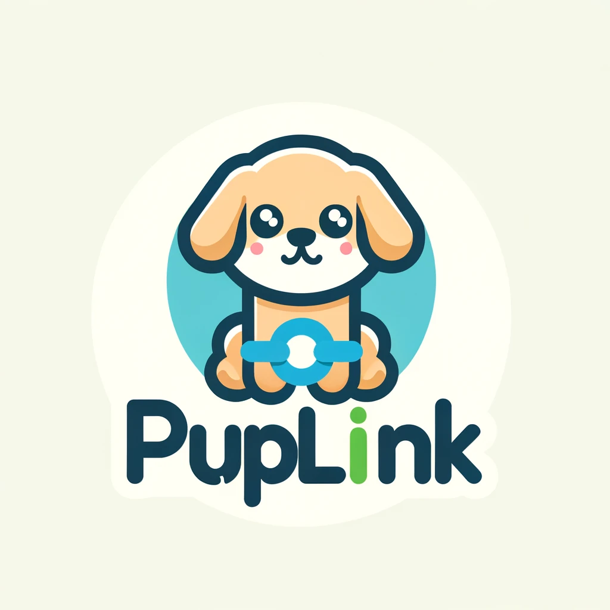

# PupLink

## About PupLink

PupLink is a cutting-edge SaaS platform designed to streamline the process of sharing digital content. With a focus on simplicity and speed, PupLink allows users to upload content quickly, generating a unique, self-destructing link for secure and ephemeral sharing.

## Features

- **Quick Upload**: Easily upload your content, including images, videos, and documents.
- **Secure Links**: Each upload generates a unique link that auto-expires after the first access.
- **User-Friendly Interface**: A minimalistic and intuitive interface ensures a seamless user experience.
- **Broad Compatibility**: Supports various file formats for diverse content types.

## Getting Started

To get started with PupLink, follow these simple steps:

1. **Installation**
   - Instructions on how to install or access PupLink.

2. **Uploading Content**
   - Step-by-step guide on how to upload content and generate links.

3. **Sharing and Managing Links**
   - Instructions on how to share generated links and track their usage.

## Development Setup

- Details about setting up the development environment for contributors.

## Roadmap

#### Configuring S3 with Serverless
- [x] **Define S3 Bucket in serverless.yml**
  - [x] Add S3 bucket configuration in the `serverless.yml` file.
  - [x] Set up necessary IAM role permissions for bucket access.

#### Developing Lambda Functions with Serverless

##### Lambda for Image Upload
- [x] **Configure Upload Function in serverless.yml**
  - [x] Define the details of the upload function in `serverless.yml` (name, trigger events, etc.).
- [x] **Develop and Test Upload Function**
  - [x] Write the upload function code.

##### Lambda for URL Generation
- [ ] **Configure URL Generation Function in serverless.yml**
  - [ ] Define the details of the URL generation function in `serverless.yml`.
- [ ] **Develop and Test URL Generation Function**
  - [ ] Write the URL generation function code.
  - [ ] Perform local testing.

##### Lambda for URL Destruction
- [ ] **Configure URL Destruction Function in serverless.yml**
  - [ ] Add the configuration of the URL destruction function in `serverless.yml`.
- [ ] **Develop and Test URL Destruction Function**
  - [ ] Implement the logic for marking or deleting the URL.
  - [ ] Perform local testing.

#### Deployment
- [ ] **Deploy Service with Serverless Framework**
  - [ ] Use the `serverless deploy` command to deploy the entire service (S3, Lambda functions).
  - [ ] Verify proper setup on AWS cloud.

#### Post-Deployment Testing
- [ ] **Test Functions in Production Environment**
  - [ ] Validate the functioning of Lambda functions in the production environment.
  - [ ] Test integration with the S3 bucket.

## Contributing

We welcome contributions to PupLink! Please read our contributing guidelines to get started.

## Support and Contact

For support requests or queries, please reach out to [tony.tang.developer@gmail.com](mailto:tony.tang.developer@gmail.com).

## License

PupLink is licensed under the [MIT License](./LICENSE).
